<div align="center">


# GG# - 전기차 P2P 에너지 거래 플랫폼

> 전기차 사용자가 남는 배터리 에너지를 개인 간 거래하고,  
> V2G(Vehicle to Grid)를 통해 전기를 판매할 수 있도록 만든 통합 플랫폼입니다.  
> 회원, 충전소, V2G 거래, P2P 게시판, 기업 관리자 기능을 하나의 흐름으로 연결했습니다.


</div>

---

## 기획 의도

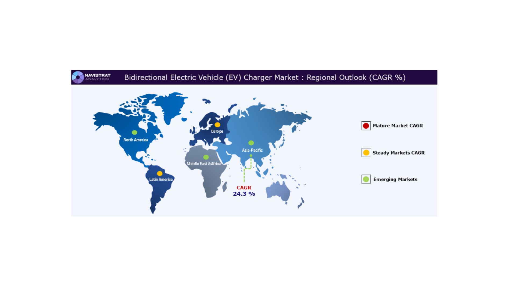

본 프로젝트는 전기차 보급 확대에 따라 발생하는 **충전 인프라 부족**, **배터리 에너지 활용 비효율**, **개인 간 에너지 거래 부재**를 해결하기 위해 기획했습니다.

1. **충전 수요 증가**
   - 전기차 사용자가 늘어나면서 충전소 탐색, 충전 가능 여부, 충전소 관리 기능의 필요성이 커졌습니다.

2. **남는 배터리 에너지 활용**
   - 전기차 배터리를 단순 이동 수단의 일부가 아니라 에너지 저장소로 보고, 남는 전기를 거래하거나 판매할 수 있는 구조를 설계했습니다.

3. **신뢰 가능한 거래 관리**
   - 에너지 거래는 회원, 충전소, 거래 금액, 판매 전력량이 명확히 기록되어야 하므로 세션 기반 회원 인증과 관리자 거래 관리 기능을 함께 구성했습니다.

---

## 서비스 개요

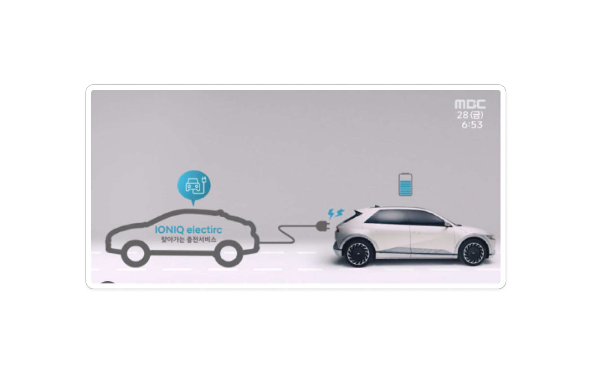

GG#은 전기차 보유자와 충전이 필요한 사용자를 연결하는 P2P 거래 모델을 기반으로 합니다.

- 전기차 보유자는 남는 전기 에너지를 판매할 수 있습니다.
- 충전이 필요한 사용자는 P2P 게시판을 통해 거래를 탐색할 수 있습니다.
- 기업 관리자는 충전소, 회원, 직원, V2G 거래 내역을 관리할 수 있습니다.
- 플랫폼은 거래 기록과 사용자 흐름을 관리하여 신뢰 가능한 에너지 거래 경험을 제공합니다.

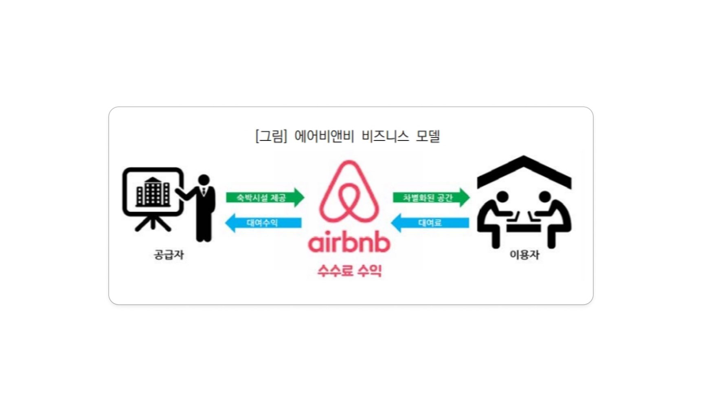

---

## 기대 효과

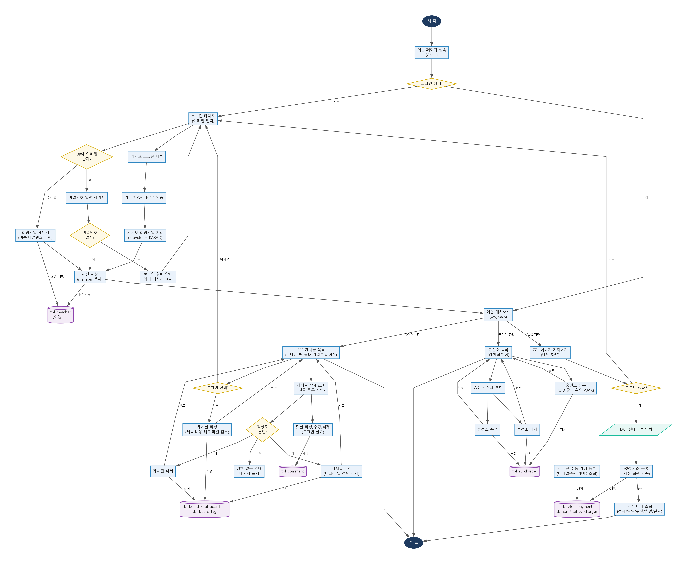

1. **충전 접근성 개선**
   - 충전소 정보를 등록, 조회, 검색할 수 있어 사용자와 관리자가 충전 인프라를 더 쉽게 파악할 수 있습니다.

2. **에너지 활용 효율 증가**
   - 사용하지 않는 배터리 잔량을 거래 대상으로 전환하여 에너지 낭비를 줄일 수 있습니다.

3. **사용자 수익 기회 제공**
   - 전기차 보유자가 남는 에너지를 판매하며 추가적인 경제적 가치를 만들 수 있습니다.

4. **관리자 운영 효율 향상**
   - 회원, 충전소, 직원, 거래 내역을 관리자 화면에서 확인하고 관리할 수 있습니다.

---

## 기술 스택

| 구분 | 기술/도구 |
|------|-----------|
| **Language** | Java 17, Kotlin stdlib |
| **Backend** | Spring Boot 3.5, Spring MVC |
| **View** | Thymeleaf, HTML, CSS, JavaScript |
| **Database** | MySQL |
| **Persistence** | MyBatis |
| **Build** | Gradle |
| **Library** | Lombok, Gson, Thumbnailator, Spring Mail |
| **Auth** | Session, Cookie, Kakao OAuth 2.0 |
| **Tool** | IntelliJ IDEA, VS Code, Git, GitHub, Postman, Sourcetree |
| **Test** | JUnit5, Spring Boot Test, MyBatis Test |

---

## 주요 기능

### 1. 회원 및 인증


- 이메일 기반 로그인 및 회원가입
- 신규 회원 자동 분기
- 카카오 OAuth 2.0 로그인
- 아이디 기억 쿠키 처리
- 세션 기반 로그아웃
- 회원 목록, 상세, 수정, 검색, 페이징

### 2. EV 충전기 관리

- 충전소 등록, 목록, 상세, 수정, 삭제
- 주소, 설치일, 비고 기반 검색
- 충전소 UID 중복 확인 AJAX API
- 기업 관리자 화면 연동

### 3. ZZ1 V2G 에너지 거래

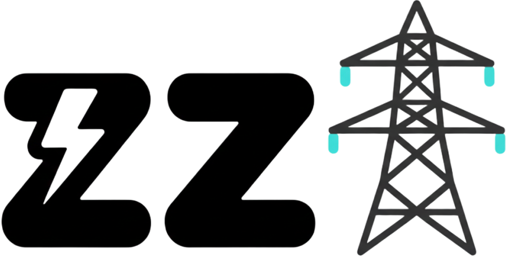

- V2G 거래 목록 조회
- 전체, 일별, 주별, 월별, 날짜 검색 탭
- 이메일 기반 회원 조회 AJAX
- UID 기반 충전기 조회 AJAX
- 로그인 회원 기반 에너지 기여 등록
- 기업 관리자 거래 수동 등록

### 4. P2P 거래 게시판

- 게시글 작성, 목록, 상세, 수정, 삭제
- 작성자 본인 여부 검증
- 파일 첨부 및 이미지 리사이징
- 태그 등록 및 선택 삭제
- 댓글 작성, 수정, 삭제
- 구매/판매 필터, 키워드 검색, 페이징

### 5. 프로필 및 공통 기능

- 닉네임, 주소, 비밀번호 변경
- 프로필 이미지 업로드
- 공통 파일 업로드 처리
- 예외 상황별 에러 메시지 처리

---

## ERD

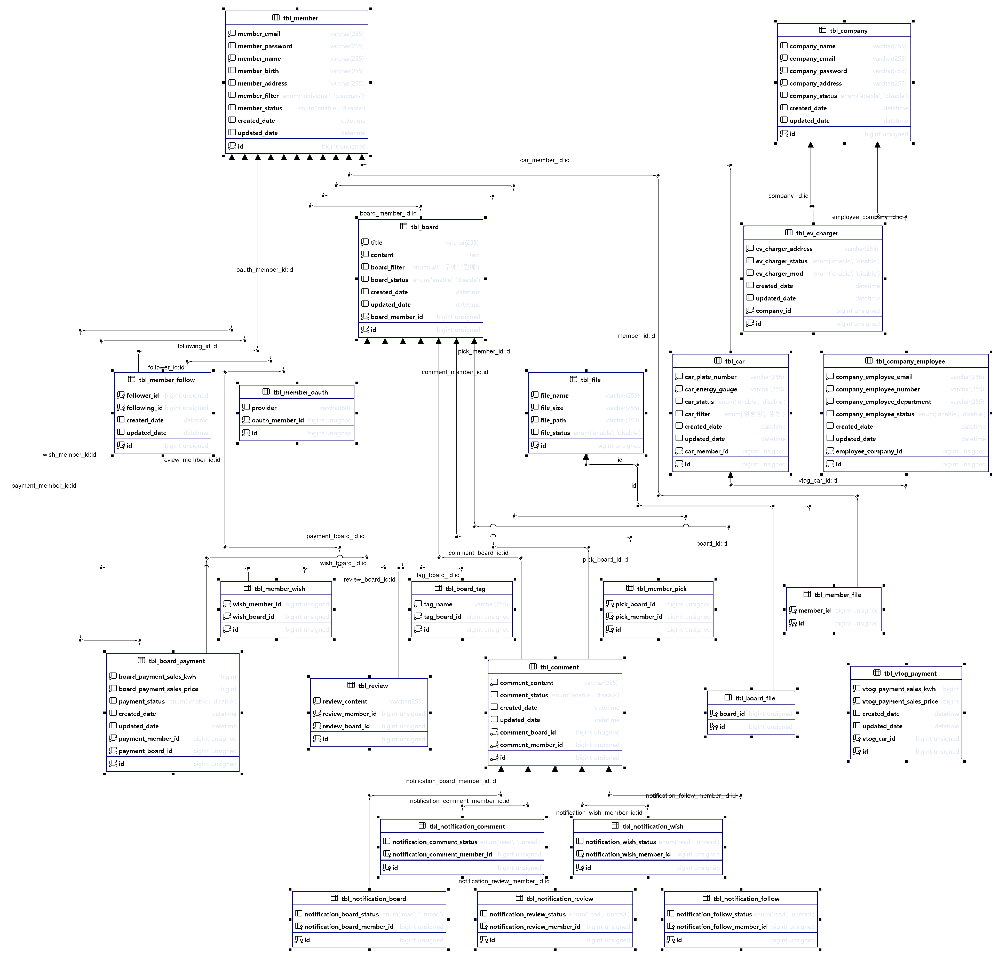

| 테이블 | 설명 |
|--------|------|
| `tbl_member` | 회원 정보 |
| `tbl_ev_charger` | EV 충전소 정보 |
| `tbl_car` | 회원 차량 정보 |
| `tbl_board` | P2P 거래 게시글 |
| `tbl_board_file` | 게시글 첨부파일 |
| `tbl_board_tag` | 게시글 태그 |
| `tbl_board_payment` | 게시글 결제 내역 |
| `tbl_comment` | 게시글 댓글 |
| `tbl_company` | 기업 정보 |
| `tbl_company_employee` | 기업 직원 정보 |
| `tbl_vtog_payment` | V2G 에너지 거래 내역 |

---

## 담당 업무

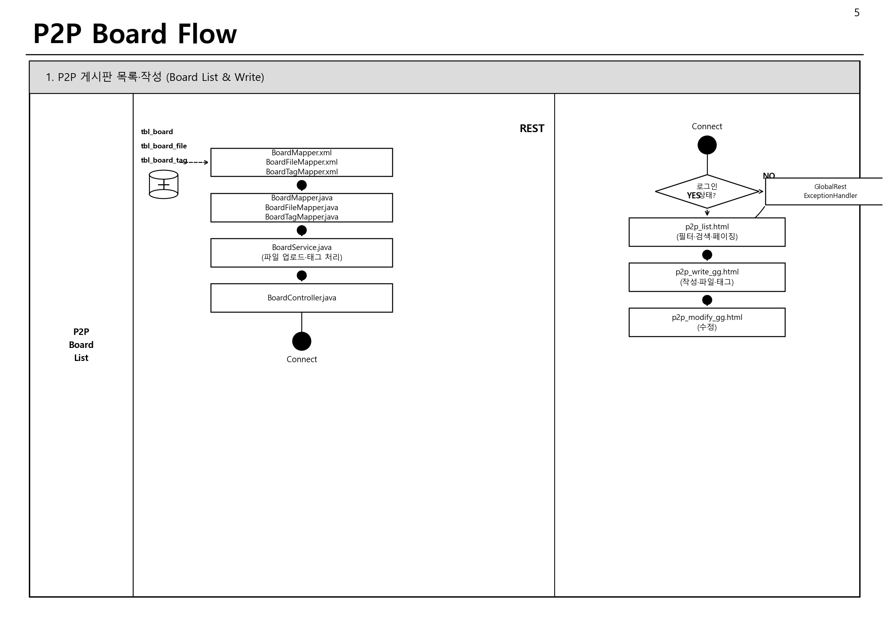

### 회원 및 인증

- 로그인, 회원가입, 로그아웃 흐름 구현
- 아이디 기억 쿠키 처리
- 카카오 OAuth 로그인 흐름 연결
- 회원 목록, 상세, 수정, 검색, 페이징 구현

### EV 충전기 관리

- 충전기 CRUD 구현
- 충전기 UID 중복 확인 API 구현
- 검색 및 페이징 처리
- 관리자 화면과 데이터 흐름 연결

### V2G 에너지 거래

- 거래 목록 탭 필터 구현
- 날짜 검색 및 페이징 처리
- 회원 이메일 조회 API 구현
- 충전기 UID 조회 API 구현
- 로그인 회원 기반 ZZ1 에너지 기여 등록 구현

### P2P 게시판

- 게시글 CRUD 구현
- 작성자 권한 검증 추가
- 파일 업로드 및 Thumbnailator 이미지 처리
- 태그 등록, 삭제 처리
- 댓글 작성, 수정, 삭제 구현
- 구매/판매 필터, 키워드 검색, 페이징 구현

### 공통

- DTO/VO 설계
- MyBatis Mapper 및 XML 작성
- Service, DAO, Controller 계층 구성
- 예외 상황 처리 및 리다이렉트 흐름 정리
- 화면 연동 및 기능 테스트

---

## 서비스 플로우차트

### Login Flow - 로그인 페이지

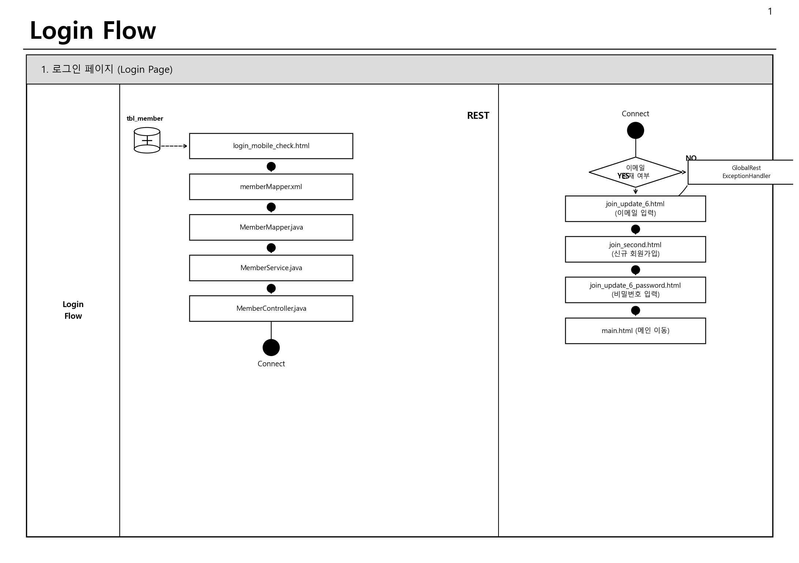

### Kakao OAuth Flow

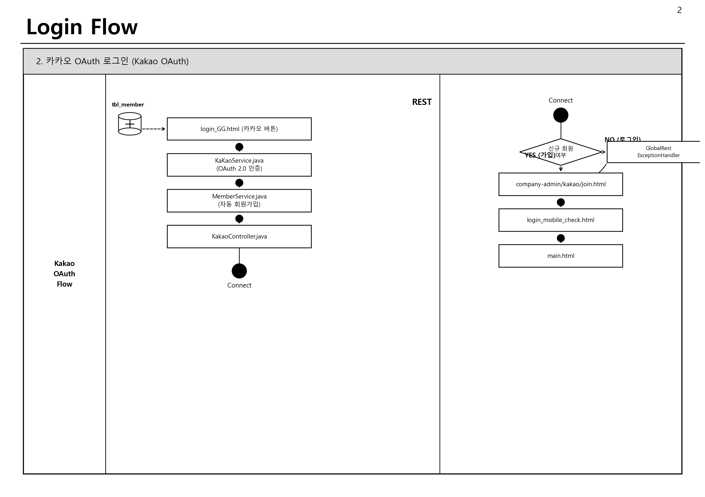

### EV Charger Flow

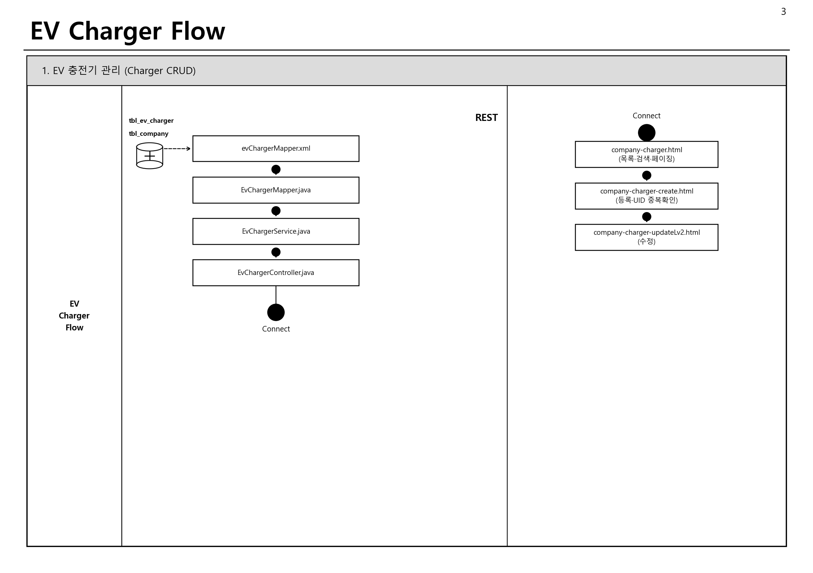

### V2G Flow

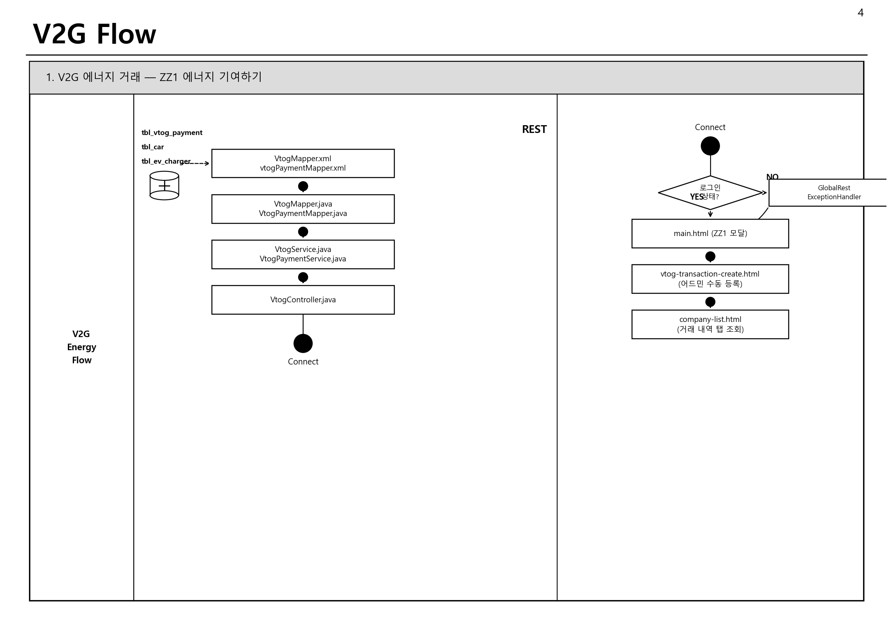

### P2P Board Flow - 목록과 작성


### P2P Board Flow - 상세와 댓글

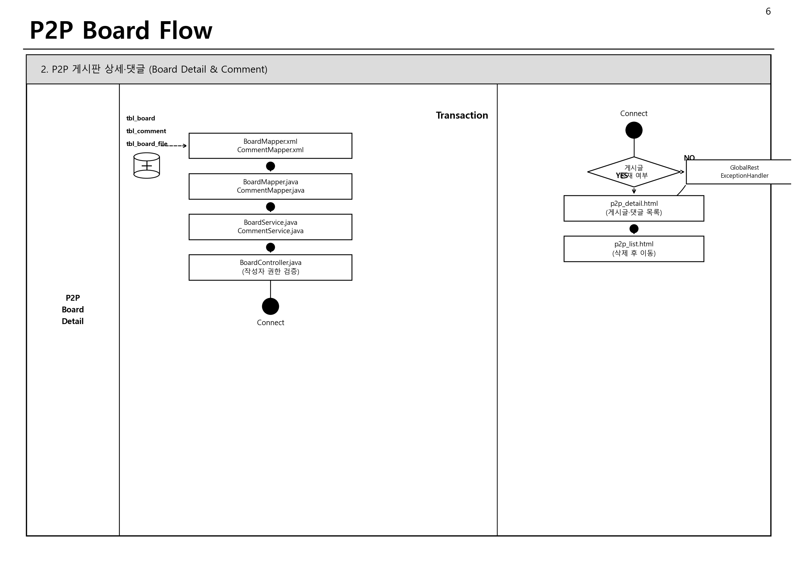

### Company Employee Flow

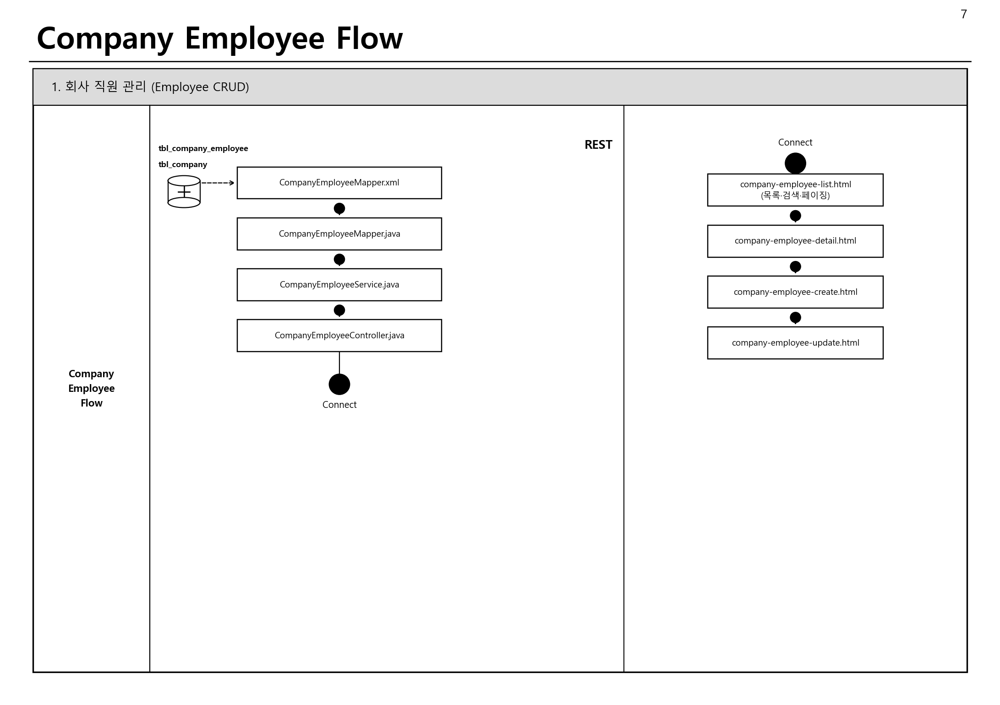

---

## 트러블 슈팅

### 1. 로그인 단계에서 DB 연결 실패 시 500 에러 노출

#### 문제 상황

- 이메일 확인 단계에서 DB 연결 오류가 발생하면 사용자 화면에 500 에러가 그대로 노출되었습니다.

#### 원인

- `memberService.existsByEmail()` 호출 중 발생한 예외를 컨트롤러에서 처리하지 않아 예외가 그대로 전파되었습니다.

#### 해결

```java
try {
    exists = memberService.existsByEmail(trimmedEmail);
} catch (Exception ex) {
    if (!isDbConnectionIssue(ex)) {
        redirectAttributes.addAttribute("error", "invalidCredential");
        return new RedirectView("/ev/company/loginLv2");
    }
    redirectAttributes.addAttribute("error", "dbUnavailable");
    return new RedirectView("/ev/company/loginLv2");
}
```

- DB 연결 예외를 판별하고, 사용자에게 적절한 에러 상태를 전달하도록 처리했습니다.

### 2. 게시글 수정 POST 요청 권한 검증 누락

#### 문제 상황

- 수정 화면 진입 시에는 작성자 검증이 있었지만, 실제 수정 처리 요청에는 검증이 부족했습니다.

#### 원인

- GET 요청과 POST 요청의 검증 흐름이 분리되어 있었고, POST 로직에 작성자 ID 비교가 누락되었습니다.

#### 해결

```java
BoardDTO foundBoard = boardService.detail(boardDTO.getId());
if (!member.getId().equals(foundBoard.getBoardMemberId())) {
    redirectAttributes.addFlashAttribute("errorMessage", "본인이 작성한 게시글만 수정할 수 있습니다.");
    return "redirect:/p2p/detail/" + boardDTO.getId();
}
```

- 수정 처리 단계에서도 세션 회원 ID와 게시글 작성자 ID를 비교해 직접 POST 요청을 차단했습니다.

### 3. 로그아웃 후 Referer 리다이렉트 무한 반복

#### 문제 상황

- 로그아웃 후 이전 페이지로 이동하도록 처리했을 때, 인증이 필요한 페이지로 되돌아가며 로그인 흐름이 반복되었습니다.

#### 원인

- 보호 페이지가 Referer로 저장되면 로그아웃 이후 다시 보호 페이지로 이동하는 순환 구조가 발생했습니다.

#### 해결

- 로그아웃 후 이동 경로를 `/main`으로 고정해 인증 페이지 재진입 문제를 막았습니다.

---

## QA 테스트

- 회원가입, 로그인, 로그아웃 테스트
- 카카오 OAuth 로그인 테스트
- 회원 목록, 상세, 검색, 페이징 테스트
- EV 충전기 CRUD 및 UID 중복 확인 테스트
- V2G 거래 등록, 조회, 탭 필터 테스트
- P2P 게시글 CRUD 및 권한 검증 테스트
- 파일 업로드, 이미지 리사이징 테스트
- 태그, 댓글, 검색, 필터, 페이징 테스트

---

## 총평

### 기획

- 전기차 충전소, 회원, 차량, 거래 내역, 게시판이 서로 연결되어 있어 화면 중심이 아니라 데이터 흐름 중심으로 설계하는 것이 중요했습니다.

### 구현

- MyBatis 기반으로 Mapper, DAO, Service, Controller 계층을 분리하면서 Spring MVC 웹 서비스의 전체 요청 흐름을 경험했습니다.  
- 파일 업로드, OAuth 로그인, AJAX 조회, 페이징, 권한 검증처럼 실제 서비스에 필요한 기능을 직접 구현했습니다.

### 개선점

- 초기 단계에서 인증, 권한, 에러 처리 정책을 더 명확히 문서화했다면 후반 수정 비용을 줄일 수 있었을 것 같습니다.  
- 다음 프로젝트에서는 기능 구현 전 예외 상황과 권한 기준을 먼저 정리하고 개발에 들어가는 방식으로 개선하고 싶습니다.

---

**작성자:** 정찬호 &nbsp;&nbsp;&nbsp;&nbsp; **TEAM:** GG#  
**기간:** 2026.02 ~ 2026.05
