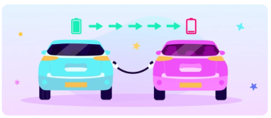

<div align="center">


# ⚡ GG# — 전기차 P2P 에너지 거래 플랫폼

> 전기차 사용자들이 남은 배터리 에너지를 서로 거래하고,  
> V2G(Vehicle to Grid)로 한전에 전기를 판매하는 통합 플랫폼


</div>

---

## 목차

1. [기획 배경](#-기획-배경)
2. [기술 스택](#-기술-스택)
3. [주요 기능](#-주요-기능)
4. [담당 업무](#-담당-업무)
5. [서비스 플로우차트](#-서비스-플로우차트)
6. [DB 구조](#-db-구조)
7. [트러블 슈팅](#-트러블-슈팅)

---

## 📌 기획 배경

### 전기차 충전 시장의 폭발적 성장


양방향 전기차(V2G) 충전기 시장은 전 세계적으로 **연평균 성장률(CAGR) 24.3%** 의 빠른 성장세를 보이고 있습니다.  
특히 아시아·태평양 지역이 주요 성장 시장으로 떠오르고 있으나, 국내에는 개인 간(P2P) 에너지 거래 플랫폼이 부재한 상황입니다.

---

### V2G — 전기차가 움직이는 발전소가 된다


IONIQ Electric의 "찾아가는 충전서비스"처럼, 전기차 배터리를 에너지 저장소로 활용해  
남는 전기를 이웃에게 판매하거나 한전에 되파는 **V2G 거래 모델**을 구현했습니다.

---

### P2P 비즈니스 모델 — 에어비앤비에서 영감을 받다


에어비앤비처럼 **공급자(전기차 보유자)** 와 **수요자(충전 필요 사용자)** 를 플랫폼이 연결합니다.  
플랫폼은 중간에서 거래를 중개하고, 참여자 모두가 이익을 얻는 구조입니다.

<br>



---

## 🛠 기술 스택

| 구분 | 기술 |
|------|------|
| **Language** | Java 17, Kotlin (stdlib) |
| **Framework** | Spring Boot 3.5 |
| **ORM** | MyBatis 3.0 |
| **View** | Thymeleaf, HTML / CSS / JavaScript |
| **DB** | MySQL 8.0 |
| **Build** | Gradle |
| **Library** | Lombok, Thumbnailator, Gson, Spring Mail |
| **Auth** | Session / Cookie, Kakao OAuth 2.0 |
| **Server** | 내장 Tomcat (port: 10000) |

---

## ✅ 주요 기능

### 1. 회원 시스템


- **단계별 로그인 흐름** : 이메일 입력 → DB 조회 → 신규 회원이면 회원가입 자동 분기, 기존 회원이면 비밀번호 입력
- **카카오 OAuth 2.0** 소셜 로그인 지원
- **아이디 기억** 쿠키 (1시간 유지)
- 이메일 중복 확인 (AJAX), 세션 기반 로그아웃

---

### 2. EV 충전기 관리 (기업 어드민)

- 충전소 **등록 / 목록 / 상세 / 수정 / 삭제**
- 주소·설치일·비고 기반 **키워드 검색 & 페이징**
- 충전소 UID **중복 확인 AJAX API**

---

### 3. ⚡ ZZ1 — V2G 에너지 거래


- 거래 내역 **탭 조회** : 전체 / 일별 / 주별 / 월별 / 날짜 검색
- 이메일로 회원 조회, UID로 충전기 조회 **(AJAX)**
- 로그인 세션 기반 **에너지 기여하기** (kWh + 판매 금액 입력)
- 기업 어드민에서 V2G 거래 수동 등록

---

### 4. P2P 거래 게시판

- 게시글 **작성 / 목록 / 상세 / 수정 / 삭제**
  - 본인 글만 수정·삭제 가능 (작성자 ID 검증)
- **파일 첨부** : 최대 20MB, Thumbnailator로 이미지 리사이징
- **태그** 등록 및 선택적 삭제
- **댓글** 작성 / 수정 / 삭제 (로그인 필요)
- **구매 / 판매 필터** 및 **키워드 검색**, **페이징** 지원

---

### 5. 회사 직원 관리

- 직원 **등록 / 목록 / 상세 / 수정 / 삭제**
- 이름·이메일 키워드 검색 및 페이징

---

### 6. 회원 프로필 관리

- 닉네임 / 주소 / 비밀번호 변경
- 프로필 이미지 업로드 (파일 서버 저장)

---

## 📋 담당 업무

| 기능 영역 | 구현 내용 |
|----------|----------|
| **회원 시스템** | 회원가입, 로그인/로그아웃, 카카오 OAuth, 단계별 인증 흐름, 쿠키 처리 |
| **EV 충전기** | 충전기 CRUD, 검색·페이징, 중복확인 AJAX API |
| **V2G 거래** | 거래 등록·조회, ZZ1 에너지 기여 REST API, 탭별 날짜 필터 |
| **P2P 게시판** | 게시글·댓글 CRUD, 파일 업로드, 태그 관리, 검색·필터·페이징 |
| **DB 설계** | MyBatis XML 매퍼 작성, 트랜잭션 처리 |
| **공통** | 페이지네이션 컴포넌트, 예외 처리, 세션·쿠키 관리, 에러 페이지 |

---

## 🔀 서비스 플로우차트

> 각 기능별 백엔드 아키텍처 흐름 (DB → Mapper → Service → Controller → View)

### Login Flow — 1. 로그인 페이지


---

### Login Flow — 2. 카카오 OAuth 로그인


---

### EV Charger Flow — 충전기 관리


---

### V2G Flow — 에너지 거래


---

### P2P Board Flow — 1. 게시판 목록·작성


---

### P2P Board Flow — 2. 게시판 상세·댓글


---

### Company Employee Flow — 직원 관리


---

## 🗄 DB 구조


| 테이블 | 설명 |
|--------|------|
| `tbl_member` | 회원 정보 (이메일, 비밀번호, 닉네임, 주소, 상태) |
| `tbl_ev_charger` | EV 충전소 (UID, 설치 주소, 설치일, 비고) |
| `tbl_car` | 회원 차량 정보 (차량 번호, 에너지 잔량) |
| `tbl_board` | P2P 거래 게시글 (제목, 내용, 구매/판매 필터, 상태) |
| `tbl_board_file` | 게시글 첨부파일 |
| `tbl_board_tag` | 게시글 태그 |
| `tbl_board_payment` | 게시글 결제 내역 |
| `tbl_comment` | 게시글 댓글 |
| `tbl_company` | 기업 정보 |
| `tbl_company_employee` | 기업 직원 정보 |
| `tbl_vtog_payment` | V2G 에너지 거래 내역 (kWh, 판매금액, 거래일시) |

---

## 🚨 트러블 슈팅

### 1. 로그인 흐름에서 DB 연결 실패 시 500 에러 노출

**🌩 문제**  
이메일 입력 단계에서 DB 연결이 실패하면 500 에러 페이지로 이동했습니다.

**🔍 원인**  
`memberService.existsByEmail()` 에서 발생한 예외를 컨트롤러에서 잡지 않아 그대로 전파되었습니다.

**🚀 해결**  
```java
try {
    exists = memberService.existsByEmail(trimmedEmail);
} catch (Exception ex) {
    if (!isDbConnectionIssue(ex)) {
        redirectAttributes.addAttribute("error", "invalidCredential");
        return new RedirectView("/ev/company/loginLv2");
    }
    redirectAttributes.addAttribute("error", "dbUnavailable");
    return new RedirectView("/ev/company/loginLv2");
}
```
DB 연결 예외 여부를 `isDbConnectionIssue()` 헬퍼 메서드로 판별해 사용자에게 적절한 에러 메시지를 반환하도록 수정했습니다.

---

### 2. P2P 게시글 수정 POST에서 작성자 권한 검증 누락

**🌩 문제**  
수정 페이지(GET)에서만 본인 여부를 확인하고, 실제 처리(POST)에서는 검증이 없어  
직접 POST 요청 시 타인의 게시글도 수정할 수 있었습니다.

**🔍 원인**  
GET/POST 핸들러가 분리되어 있고, POST에 별도 권한 체크 코드가 없었습니다.

**🚀 해결**  
수정 POST 핸들러에도 세션 회원 정보와 `board.getBoardMemberId()`를 비교하는 검증 로직을 추가했습니다.
```java
BoardDTO foundBoard = boardService.detail(boardDTO.getId());
if (!member.getId().equals(foundBoard.getBoardMemberId())) {
    redirectAttributes.addFlashAttribute("errorMessage", "본인이 작성한 게시글만 수정할 수 있습니다.");
    return "redirect:/p2p/detail/" + boardDTO.getId();
}
```

---

### 3. 로그아웃 후 Referer 기반 리다이렉트에서 무한 루프 발생

**🌩 문제**  
로그아웃 후 이전 페이지(Referer)로 돌아가도록 구현했는데,  
로그인이 필요한 보호 페이지가 Referer로 설정되면 로그인 요청이 무한 반복됐습니다.

**🔍 원인**  
보호 페이지 → 로그아웃 → 보호 페이지 리다이렉트 → 로그인 요구의 순환 구조였습니다.

**🚀 해결**  
로그아웃 후 리다이렉트 대상을 `/main` 으로 고정해 순환을 차단했습니다.

---

<div align="center">


**GG# | EV P2P Energy Platform**

</div>
